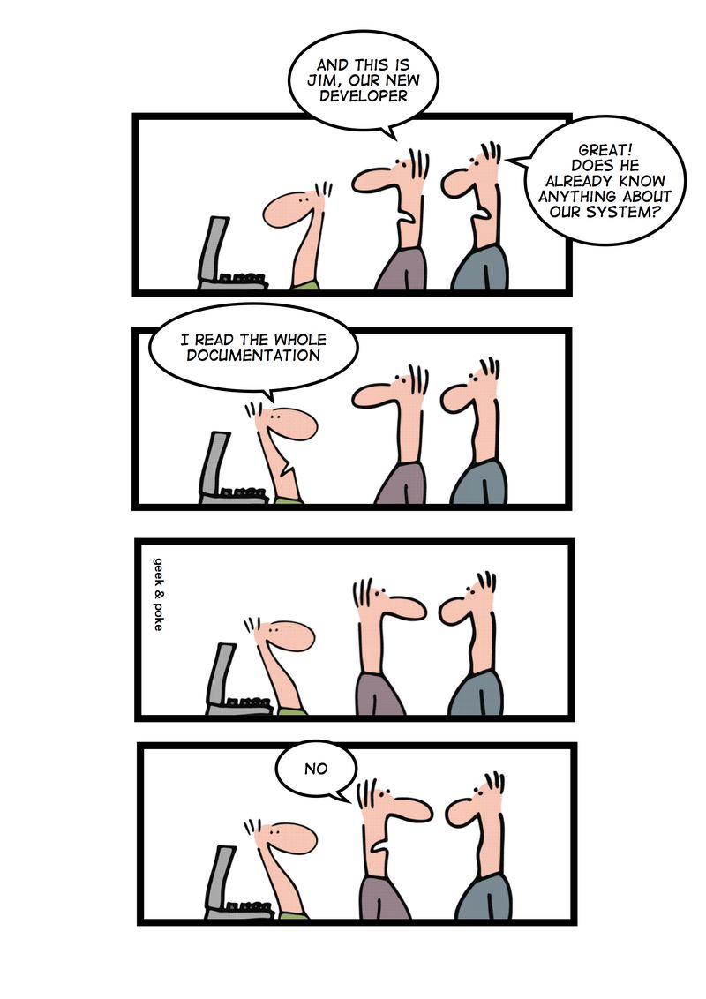

*This is a shortened version of a post originally published on [Stackify's blog](https://stackify.com/what-is-behavior-driven-development/).*  

If you’re in development, you’re no doubt familiar with [agile methodology](https://stackify.com/agile-methodology/) and the importance of testing your software. But sometimes a [test-driven approach](https://www.agilealliance.org/glossary/tdd) seems at odds with going fast. And how do you best communicate the importance of testing to everyone on your team? If you’ve felt frustrated with test-driven development or don’t have buy-in from your team, behavior-driven development is there to help.

Let’s delve into why you should use behavior-driven development and how to implement it. Plus, we’ll discuss tips and tools to make behavior-driven development work best for you.

## What Is Behavior-Driven Development?
As a developer, how do I know that the software I wrote is working? Why, [test it](https://stackify.com/fundamentals-web-application-performance-testing/), of course! Test-driven development (TDD) describes how to do this: First, write the test (that way you’re clear on what your objective is). Then, write the code to make the test pass. Great! Now what?

Though TDD provides a framework to check whether the code you wrote works as expected, it doesn’t provide clear guidance on which features to start with when developing a product. The test functions are also not obvious to people who don’t come from a software development background, which can make communication about the development cycle between the business side and the engineering side of an organization difficult. It’s these limitations of TDD that behavior-driven development (BDD) wants to improve on.

BDD is a methodology rather than a specific tool. It describes a way of talking about how your software should behave and checking that it’s behaving that way. BDD grew out of a need to not just make tests for the sake of having test coverage, but to direct testing and development to the most important behaviors the software should have. It also gives a framework for talking about tests between the business side and the tech side.

So how do you describe behavior? In BDD, [user stories](https://www.atlassian.com/agile/project-management/user-stories) are supplemented with executable scenarios written in a clear, standardized way. In this way, development always follows from clear business needs and the desired outcome is explicitly stated.

But before diving into specifics, let’s discuss why you should use BDD.

## Why Use Behavior-Driven Development?
Communication between business and development isn’t always as good as it should be. Engineers may feel tempted to add features that are "fun" rather than features that add the most business value. Managers may not understand why development takes longer than they feel it should, especially if they aren’t included in the process. And no one ever said, "Boy, I wish I could write some more documentation on this project!"

So how can we improve communication between business and development? BDD aims to solve that problem.

BDD aims to improve communication among the business side, testers, and developers. It also acts as a road map for developers to focus on the most important features first—that is, the features that clearly add value.

BDD promotes giving useful names to tests so that it’s easier to take action if a test fails. Tests are written in plain English so that the code is self-documenting. That means that you can avoid undocumented code and onboarding troubles.

Lastly, BDD aims to make the test process more intuitive to newcomers and non-engineers.

## How to Implement BDD
BDD principles can be applied to any type of testing, but because of their focus on behavior, they lend themselves best to functional tests. You’ll remember that instead of a "test" we’re going to talk about "behavior". In this vocabulary, functional tests become "the specifications of the behavior of the product".

The emphasis on "specification" highlights a core viewpoint of BDD: that the creation of unit tests and the creation of features and functional tests are really two sides of the same coin. BDD emphasizes that these two activities shouldn’t be seen as separate. According to Daniel Terhorst-North, the creator of BDD, this vision grew out of the need to have increased collaboration among developers, testers, and domain experts.

## Writing the User Story and the Given-When-Then Statement
The desired behavior should come out of the standard user story framework:

> As a (role),  
> I would like (feature)  
> so that (benefit)  

But we’ll add more. A core element of BDD is that user scenarios are written in the given-when-then style, developed by [Dan Terhorst-North and Chris Matts](https://dannorth.net/introducing-bdd/).

> Given (a specific context)  
> When (some action is carried out)  
> Then (a particular set of observable consequences should occur)  

### A Practical Example
For example, we want to have an *add to cart* feature on an online retail site. The user story might look like this:

##### Scenario: Add item to shopping cart

**As an** online customer,    
**I would like to** be able to click on "add to cart" for each item    
**so that** the item is saved to my shopping cart    

We can flesh it out into testable format with the given-when-then style. Be specific in what needs to happen. That said, test one thing, and one thing only! You can add more tests for different behaviors.

> **Given**  
> A user is looking at an item on the website
>
>  | item |
>  | ---- |
>  | book |
>  | coat |
>  | shoes|
>
> **When**  
> The user clicks on "add to cart" for the item
>
> **Then**  
> That item is added to the user’s cart
>
>  | item  |
>  | ----- |
>  | book  |
>  | coat  |
>  | shoes |

Nice! We have an easily understandable and executable scenario to test.

### Given-When-Then: A More Complex Example
We can expand on the basic given-when-then structure by adding constructors such as "and." Here’s a given-when-then statement for processing payment:

#### Scenario: Credit card payment

> **Given**  
> The user pays for the item via credit card  
> AND  
> the credit card details are valid  
> AND  
> there is sufficient credit on the account  
>
> **When**  
> The user clicks "submit payment"
>
> **Then**  
> $50 is deducted from the user’s credit card  
> AND  
> $50 is added to the store account  
> AND  
> the purchase is recorded as successful  

### Tips on Writing Good Scenarios
- Remember that test names should be as expressive as possible. BDD originally started from the idea that a test name should be a sentence describing the exact outcome that should occur. In this way, the test suite becomes the documentation for the software.
- A single test can only test behavior that can be described in a single sentence!
- Write the test name in simple business language so that everyone in the business can understand it.
- The focus is all about business value. As you finish with one test and move on to the next, you should ask, "What’s the next most important thing that the software should do?" Now let this guide your development. (See how development is now not only test driven, but also value driven?)

## Limits of Behavior-Driven Development
Like any method, BDD isn’t without its critics. Some drawbacks to note are as follows:

- BDD requires careful specification before any development happens, which may slow a team down.
- You need a content expert for domain–specific language surrounding desired behavior. If your content expert is in high demand, this can become a bottleneck for the team.
- It’s easier for developers who are already experienced in TDD to switch to BDD than it is for newcomers.
- BDD is also not a cure for everything...

## Conclusion
Behavior-driven development can help you improve collaboration and automation. One test for one feature ensures that problems can be easily traced. So even if you aren’t using BDD-specific tools, you can use the BDD principles to write better tests.

Want to learn more about BDD? [Dan Terhorst-North's](https://dannorth.net/introducing-bdd/) site is a great place to start.
