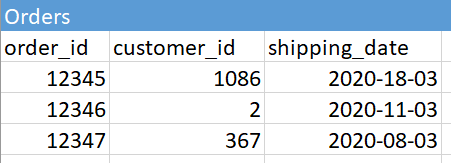

*This is a shortened version of a post first published on [Tek-Tools](https://www.tek-tools.com/database/database-management-system-and-tools)*

It’s a truth universally acknowledged that a person in possession of a good amount of data must be in want of a database management system (DBMS). However, not all database management systems are created equal.

This post tackles the issues involved in deciding on a DBMS. What should you look for when choosing a data model and a DBMS? Once you’ve decided, should you use database monitoring tools? If the answer is yes, which tools should you use? We’ll consider some of the most popular DBMS software options available, and we’ll cover what to look for in a database monitoring tool.

## What is a Database Management System?
A database is simply a structured collection of data. As you’ve no doubt learned, however, storing and accessing data can be a fine art. If you’ve ever done it the wrong way, you’ve probably faced data not being available when you needed it, data being lost or corrupted, or increasingly unmanageable databases. Keeping data updated in a reliable way (and out of reach of unsavory characters) is even harder.

Enter the DBMS. A DBMS allows you to store, manipulate, retrieve, and analyze data in a database. It solves the problem of data being stored in different formats, on different systems, and in redundant ways, which can lead to problems in the future.

A DBMS also provides you with an array of administrative functions, such as restricting access to sensitive data, tracking modifications, monitoring performance, and making backups. Additionally, it can log data for security and compliance auditing.

Since you now know why you need a DBMS, where should you start? Choosing the right DBMS depends on your needs. It also depends on the type of data you have. Before diving into different DBMS software, we’ll give you a bird’s-eye view of database models. There’s a lot to talk about here, so be aware this is a simplified analysis.

## Common Database Models
Database models describe the way databases store data, and this largely comes down to whether your data is structured or unstructured. Another factor in your choice of model is how much data you need to store and how much traffic to the database there will be.

By structured data, we mean data capable of being neatly arranged into rows and columns (like a spreadsheet). Unstructured data, on the other hand, can’t be easily coerced into ordered rows and columns. We’ll start by looking at storage for structured data because these databases have been around for a long time.

### Relational Databases
Relational databases are arguably still the bread and butter of the database world. Simply put, data is stored in different tables that have relationships with each other. For example, one table may list all customers in a company while another gives information on orders. Within a table, rows represent cases and columns represent attributes. A unit of information is stored only once to avoid redundancy.

  


#### Benefits of Relational Databases
Relational databases are strict about the type of data you can enter. The data must be valid, and all column entries must be of the specified data type (consistency). Relational databases also make sure each action is a single unit. In other words, an update either takes place or doesn’t—there is no partial updating (atomicity).

When performing several actions, the effect of each action should still be the same as if it were performed on its own (isolation). Plus, the data is protected if the system fails (durability). [ACID compliance](https://en.wikipedia.org/wiki/ACID) typically makes relational databases the best choice for financial and health-care data.

Relational databases usually use [Structured Query Language (SQL)](https://en.wikipedia.org/wiki/SQL). This makes it easy for developers to switch from one DBMS to another, as queries are standardized.

#### Downsides of Relational Databases
Because of a relational database’s rigid schema, it can be slow to set up and costly to maintain. With a large amount of data, the relations can be complex. This means relational databases don’t always handle enormous amounts of data well. This is especially true when there’s a graph or network structure to the data or when you need to have flexibility about the type of data going into the database. Most relational databases also have limits on the length of the data you can enter into a field.

#### The Big Names
Some of the big proprietary relational database management systems include [Oracle](https://www.oracle.com/database/) and [Microsoft SQL Server](https://www.microsoft.com/en-us/sql-server/default.aspx). On the open-source side, [MySQL](https://www.mysql.com/) and [PostgreSQL](https://www.postgresql.org/) dominate the field. They also have enterprise editions available.

### Non-Relational Databases
Unlike relational databases, non-relational databases are semi-structured. They can easily store various data forms, such as pictures, videos, and music. Non-relational databases were designed to handle huge amounts of data and to be highly scalable to negotiate load changes.

Non-relational (or NoSQL) databases come in many shapes and sizes, including document databases, key-value databases, graph databases, and wide column databases.

Unlike relational databases, different NoSQL databases tend to vary widely, even if they use the same underlying data model. These differences make it hard to be proficient in all the different NoSQL databases. Knowing your needs is important to prevent many false starts.

#### Document Model
Document model databases store data as a collection of documents (document-oriented) in the form of JSON or JSON-like objects. [MongoDB](https://www.mongodb.com/), arguably the most popular NoSQL database, uses this document model.

The data in a document store is saved in a nested JSON file rather than in rows and columns. The JSON example below shows what order and customer information might look like in a document store:

```javascript
{
  "orders": [
    {
      "order_id": "12345",
      "customer_id": "1086",
      "customer": [
              "customer_id": "1086",
              "first_name": "Jake",
              "last_name": "Smith",
              "phone": "9893722156",
              ]
      }
  ]
}
```
Many developers love MongoDB because it’s easy to set up, it’s flexible, and it has fast query response times. Document-oriented databases are also easy to scale horizontally through sharding (distributing data across machines). However, they don’t support joins like a relational database, and they have limited nesting capability. Not being able to join data also means there’s more data redundancy.

#### Key-Value Model
Other NoSQL databases store data as key-value pairs. In a key-value store, a key is associated with only one value.

A key-value store is commonly used to store data such as customer preferences. Key-value stores have high read/write speed and excellent availability. [Redis](https://redislabs.com/), for example, is popular because of its lightning fast in-memory data storage. However, key-value stores are not good for large data sets or data with complex relationships.

#### Graph Database Model
Graph databases put relationships at the forefront. Each node in the graph represents an entity, and each connection shows the relationship between entities. [Neo4j](https://neo4j.com/) is a popular graph database.

Graph databases are good for data with a graph structure, such as data on social networks, fraud detection, or medical history. Unfortunately, graph databases aren’t good with large volume queries or transactions.

#### Wide Column Store
A wide column store traditionally has rows and columns for data (though there are exceptions to this rule), but it’s not a relational database. A wide column store, or columnar database, emphasizes saving data by column rather than by row. Unlike in a relational database, names and data types can differ from row to row.

In columnar databases, the data can be highly compressed. It’s also easy to distribute data across multiple machines. Certain queries are fast, such as ones you need to aggregate by column (e.g., "what’s the average age of customers?"). However, transactions like inserting data become much slower than they would be in a relational database. For this reason, it’s better to do bulk inserts than many small transactions.

If you need to perform analytics on a large amount of data, a columnar database such as [Apache Cassandra](https://cassandra.apache.org/) or [Amazon DynamoDB](https://docs.aws.amazon.com/dynamodb/index.html) might be right for you.

## Things to Think About When Choosing a DBMS
To sum up all this information, here are a few aspects you should consider when choosing a DBMS:

- Database model
- Consistency
- Availability
- Cost
- Security
- Usability
