*This post was originally published on [Plutora's blog](https://blog.panoply.io/how-to-analyze-mongodb-data-in-tableau).*  

MongoDB's data flexibility is a breeze for developers but can be a major headache for analysts and data scientists! Here's how to wrangle your non-relational MongoDB data into a Tableau-friendly shape using JSON exports, the MongoDB Connector for Business Intelligence, and data tools like Panoply.

## Why MongoDB?

[MongoDB](https://www.mongodb.com/) is an open-source non-relational, or NoSQL, database. Unlike relational databases like Microsoft SQL Server or MySQL, it doesn't store data in row-and-column-format tables with rigid schemas. Instead, it stores data in an unordered collection of documents, where a collection resembles a table and a document resembles a record, or row, in a relational database. Because data doesn't have to have a consistent number of fields (columns) to be stored in a collection, MongoDB offers many advantages over relational databases, particularly when working with unstructured data. It's quick to get a database up and running, and it can flexibly store data of different dimensions. For this reason, MongoDB is popular among developers who want to build and iterate fast.

However, because [Tableau](https://www.tableau.com/) is built on a relational database structure and uses SQL queries, we need to do some data transformations to be able to work with MongoDB data in Tableau. In MongoDB, documents are nested JSON-like objects, so the data either needs to be flattened to resemble a table or transformed to a virtual relational database. We'll look at a few ways to do this, ranging in technical difficulty, ease of replication, and cost.

## 1. Export MongoDB Collections to JSON

We'll start with JSON exports because this solution requires no software connectors or drivers. It also doesn't require specific versions of Tableau or MongoDB.

If you've [installed MongoDB](https://docs.mongodb.com/manual/installation/) on your computer, you can connect directly to the database and export the collection to a JSON file. You can then import the JSON file into Tableau for analysis.

To export data from MongoDB, type the following command in your terminal, replacing the arrows (<>) and the text within them with your database details:

``mongoexport --host <your cluster / host name> -ssl --username <username> --password <password> --authenticationDatabase admin
--db <database name> --collection <collection name> --type json --out <filename.json>``

For example, we'll import the database sample_supplies and collection sales from [MongoDB Atlas's sample data](https://docs.atlas.mongodb.com/sample-data/sample-supplies/#std-label-sample-supplies). We'll use user **user** and password **password**. Note that this is just an example cluster connection, so this exact code will not work on your computer.

``mongoexport --host cluster0.qdpsk.mongodb.net -ssl --username user --password password --authenticationDatabase admin
--db sample_supplies --collection sales --type json --out sales.json``

In Tableau, click on *New Data Source | JSON File* and select your file. You'll be prompted to select the "schema levels" for your data. Note that data will be replicated to accommodate all the levels (similar to when you do a join), so select only what you need and aggregate the data later to not count records more than once.

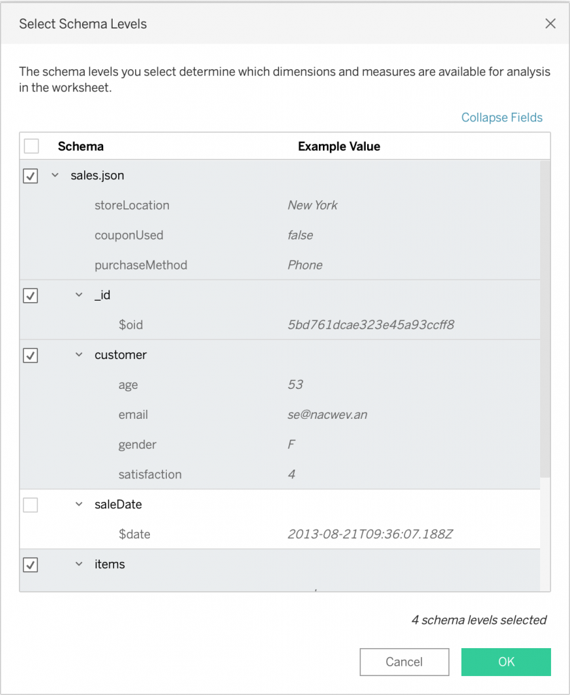

Once you've selected the measures and dimensions you want to use, you'll be able to see the data in a row-and-column format in Tableau, and you can continue with your analysis as usual!

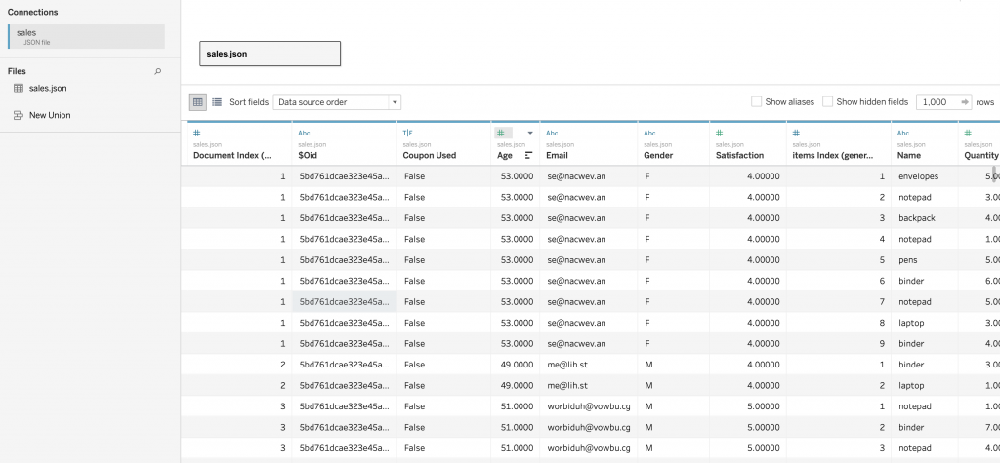

There are downsides to this approach. Although it's relatively simple, you'll have to manually export your data from MongoDB each time. That's not ideal. The next methods overcome the problem of having to manually import data to Tableau each time you want to run an analysis. However, at this time, this method is the only one available to you if you're using Tableau Public.

## 2. The MongoDB Connector for Business Intelligence (BI)

The official way to connect Tableau and MongoDB is through the BI Connector. The MongoDB BI Connector ensures that your data stays in sync. You can also use basic SQL queries to directly query the data via the connector. Note that not all SQL queries will work (we're doing some SQL to NoSQL jiujitsu after all), so it's best to keep your queries simple and check that they're [supported by MongoDB](https://docs.mongodb.com/bi-connector/master/supported-operations/).

### Requirements

For this method, you'll have to install the [MongoDB BI Connector](https://docs.mongodb.com/bi-connector/master/installation/) (version 2.1 or later) to connect Tableau to MongoDB. **You'll need Tableau Desktop or Tableau Prep to access the connector; it's not available in Tableau Public. You may also need additional drivers.** The MongoDB BI Connector uses the MySQL driver. If you are prompted to install additional drivers, close Tableau, install the required drivers, and then proceed. (MacOS users be warned: Installing the ODBC drivers made the Hobbits' journey through Middle-earth seem like a nice Sunday afternoon outing in comparison.)

Finally, you'll need a database and a running [mongosqld instance](https://docs.mongodb.com/bi-connector/current/reference/mongosqld/#std-label-mongosqld-usage-examples) specifying the database to use the connector. The MongoDB BI Connector installation also installs **mongosqld**. You can [run mongosqld](https://docs.mongodb.com/bi-connector/current/launch/) in the terminal from the directory in which it is installed.

### Connect to the Data Source

In Tableau, select *MongoDB BI Connector in Connect | To a Server | More...*

Provide your server, database, and user information in the MongoDB BI Connector window.

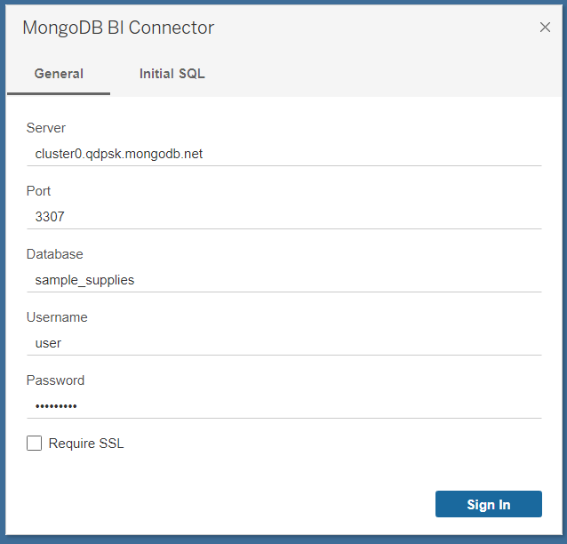

### A Note on Authentication

If your MongoDB instances require [authentication](https://docs.mongodb.com/bi-connector/current/connect/tableau/), your BI Connector will also have to use authentication.

In MongoDB, a user is associated with specific databases. Make sure your user has permission to read from the database of interest. When signing in, you'll always need to give your username and the database source. For example, if your username is **user** and the database is **sample_supplies**, you'll sign in as **user?source=sample_supplies**. By default, the authentication mechanism is SCRAM-SHA-1.

Unfortunately, if you're running a production database, the MongoDB Connector for BI is only available with MongoDB Enterprise 3.2 and greater. If you don't have the budget for the enterprise version of MongoDB, you'll need another way to connect.

## 3. Connecting With Third-Party Services

If these options seem a little daunting or time-consuming to you, you can use third-party Open Database Connectivity (ODBC) drivers to link MongoDB to Tableau. Alternatively, use a cloud data warehouse like [Panoply](https://panoply.io/platform/), which provides a no-code way to [connect to both MongoDB and Tableau](https://panoply.io/integrations/mongodb/tableau/). If you prefer a click-and-drag option, this is the easiest way to get and analyze your MongoDB data in Tableau, so I'll walk through this setup. Panoply also connects to a variety of data sources, not just MongoDB and Tableau, and automatically syncs your data.

### Allowlist Panoply in Your MongoDB Database Service

First, you'll have to allow Panoply access to your database. From your MongoDB database service (here we're using MongoDB Atlas), under *Network Access*, [add Panoply's IP addresses to the Access List](https://panoply.io/docs/data-security/whitelisting/#ip-whitelisting).

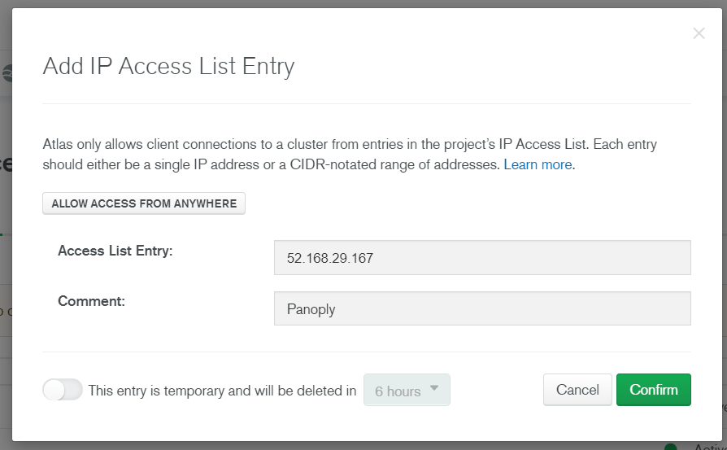

After allowlisting, Panoply's IP addresses will appear in your IP Access List. Now you can connect the two services.

### Add a Data Source in Panoply

Within Panoply, select *Add New Data Source* and enter your information. Continuing with the **sample_supplies** collection that we created on MongoDB Atlas, we can enter the information in the picture below to connect.

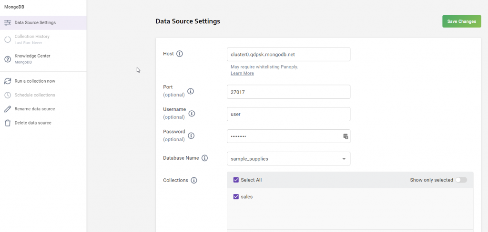

Select *Save Changes* and *Collect Data*. After the data has been collected (which can take a few minutes, depending on the collection size), you'll be able to view your data!

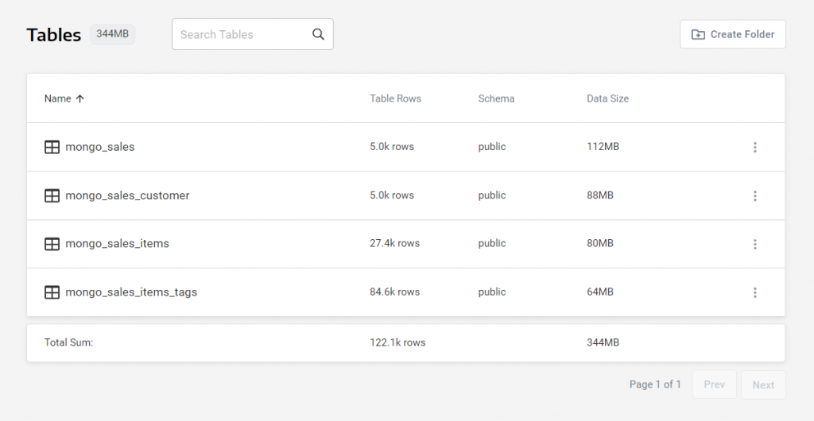

### Connect to Tableau

Next, select *Connect to a BI Tool* in Panoply to show the connection data that you'll enter in Tableau.

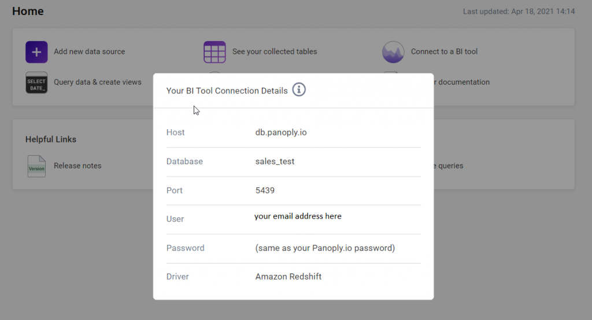

Within Tableau, go to *Connect | To a Server | More...* and select *Amazon Redshift*. Enter your BI connection details as given by Panoply. Note that you're connecting to Panoply, so your user and password details will be your email address and password for Panoply, not your MongoDB user details.

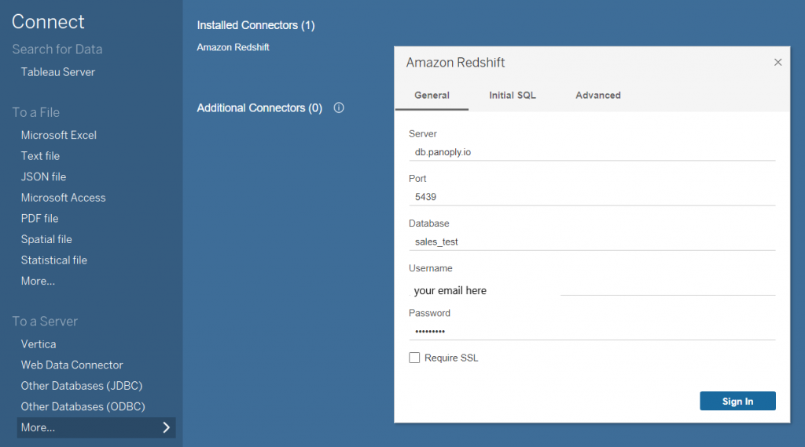

Select public from the Schema drop-down on the left to view your tables and drag the desired tables to the top pane to relate them.

The MongoDB collections now appear as tables in Tableau. Here, we've related **mongo_sales** with **mongo_sales_items** on sales ID.

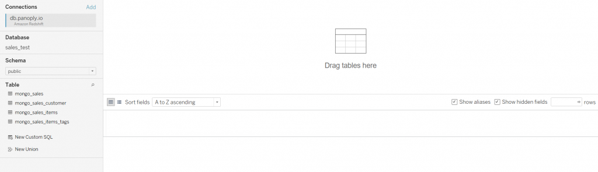
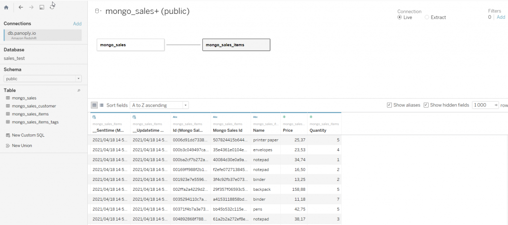

We can now analyze and visualize the data as usual. Success!

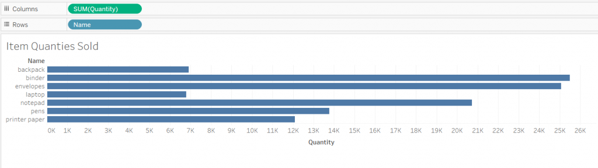

## Conclusion

You now have a range of different tools in your toolbox to connect MongoDB to Tableau: import JSON files, use the MongoDB Connector for BI, use Tableau third-party ODBCs, or use a separate data platform. And if you're looking for an easy and comprehensive solution to what can be a frustrating set of connections, check out Panoply and sign up for their free trial [here](https://panoply.io/trial/).

Go forth and analyze!
