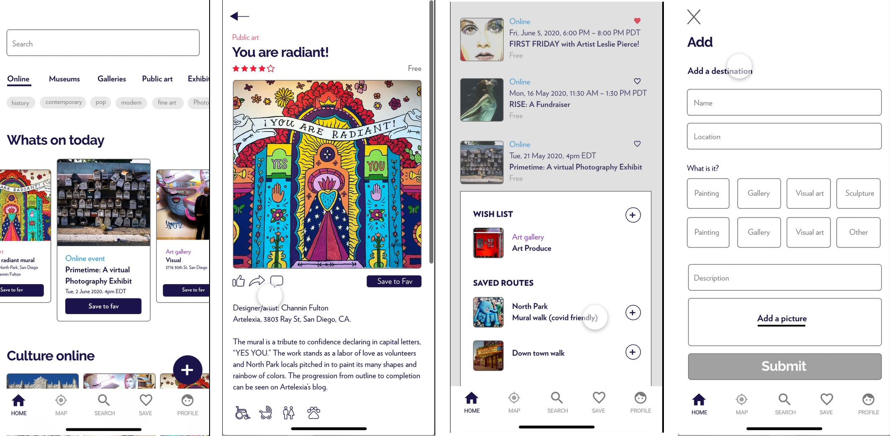

### About Us
[City Canvas](https://www.citycanvas.org) is a centralized platform that celebrates local culture of the city by offering an immersive cultural experience. Discover and share cultural landmarks, artwork, events and more on the app. Experience culture online or go for a cultural walk and stop for coffee along the way. Get rewarded for your cultural curiosity and knowledge of the local art scene! And if you are an artist or business, you get the chance to share your world for others to experience your wares.

### Key Features
Experience San Diego's art scene differently! City Canvas highlights local cultural places and events by offering a holistic immersive experience and helping people overcome their barriers to engage with the arts and culture of the city through gamification.   

You can:  
- Discover and map local culture
- Create and share cultural routes
- Add and find experiences

#### What Makes City Canvas Different?
- Focus on local, 'underground' cultural assets and up-and-coming artists
- Holistic experience
- Rewarding
- Practical and accessible

#### UX Values
- Intuitive
- Customizable
- Flexible

#### Benefits

##### For Users
- Find what’s nearby
- Discover local arts
- Ability to pre-plan
- Save time
- Share local art-related spots
- Ease of use
- Be part of a community

##### For Cities
- Understand ROI of government arts funding
- Increase public engagement
- Acquire cultural asset data
- Acquire data about consumer engagement
- Enhance community-based spending
- Administrative ease of use

##### For Businesses
- Drive sales
- Get leads
- Access targeted marketing
- Increase revenue

Discover more on our [website](https://www.citycanvas.org) and subscribe to our [blog!](https://www.citycanvas.org/blog).

### SCALE SD Urban Innovation Program 2020
City Canvas was first developed during the SCALE (Smart Cities Labs Accelerator + Environment) San Diego, US Ignite and Cox Communication [Urban Innovation Challenge 2020](https://www.scalesd.com/innovation-2020/). City Canvas walked away as the **winning team** at the end of the 3-month challenge.

### The Team
- Nazima Ahmad
- Michelle Hoogenhout
- Errick Santos
- Dibwe Kalangu
- Sasha Talaie
