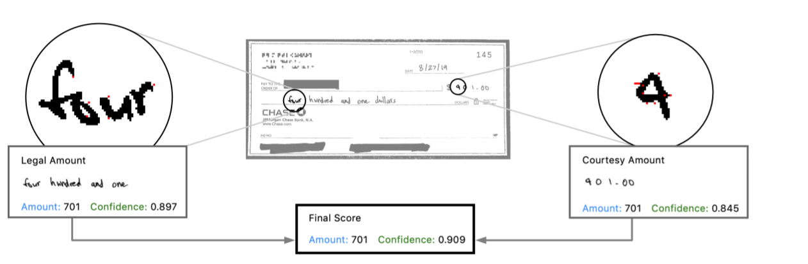

Machine learning is incredibly powerful: Models such as neural networks can learn complex non-linear relationships between features to detect objects, recognize images or audio, forecast sales, predict disease diagnosis, and more. But **neural networks come at a cost: interpretability**. There have been [several](https://science.sciencemag.org/content/366/6464/447) [recent](https://www.ifsecglobal.com/video-surveillance/why-ai-and-facial-recognition-software-is-under-scrutiny-for-racial-and-gender-bias/) [media](https://www.forbes.com/sites/falonfatemi/2020/04/15/three-platforms-where-ai-bias-lives/?sh=197e7119b0c1) [articles](https://www.linkedin.com/news/story/the-risks-of-ai-bias-in-recruitment-4970044/) about how machine learning models have failed because of insufficient or biased data (models are typically much worse at recognized faces and speech of women and minority groups).

And because the features that neural networks prioritize are not clear, these networks can also be easily manipulated. Just remember what happened when [Microsoft released a Twitter chatbot](https://spectrum.ieee.org/tech-talk/artificial-intelligence/machine-learning/in-2016-microsofts-racist-chatbot-revealed-the-dangers-of-online-conversation), and within hours had to take it down. Because of the racist, misogynistic and other hate speech that trolls fed it, it became a writer of hate speech itself! Others have shown how easy it can be to [manipulate audio](https://nicholas.carlini.com/code/audio_adversarial_examples) and [images](https://openai.com/blog/adversarial-example-research/). Think about the ubiquity of the devices that are vulnerable to these kinds of attacks: Alexas and other voice recognition systems, surveillance systems looking for criminals or terrorists, image recognition systems processing cheque payments, and self-driving or AI-assisted cars to name just a few.

How can you protect your business against model failure? **It is imperative that we think not only of accuracy-based metrics when we evaluate models, but also robustness** (i.e. the ability to make the correct prediction despite noisy and potentially altered data). Why? Well, **all the adversarial attacks described in the paper are 100% effective at fooling neural networks that have not been made robust to attacks**. If your model is open to the public, adversarial attacks are something that you should be aware of.

*This [journal club talk](https://docs.google.com/presentation/d/1xLORa3GT6v_buf0Q9gbWkn71wAAiXGhWWluFP12vtXk/edit?usp=sharing) discusses the latest developments in adversarial attacks and defenses in machine learning.*

## Adversarial attacks
An adversarial attack is any attempt to fool a machine learning model. Typically, attacks can either try to alter the data during the training or test phase itself (so-called **poisoning attacks**), or feed altered samples to the model afterwards and systematically find the smallest possible changes in the sample that would lead to the model giving a wrong answer (**evasion attacks**). We'll focus mostly on evasion attacks.

In the picture below, simply by adding some non-random pixelation, the authors changed the value of a cheque from $401 to $701.

The attacker may also have different amounts of information available about the systems that it's attacking. In a **white-box attack**, all the information about the model type, architecture, parameters and hyperparameters are available. Even the best current adversarial defenses struggle to completely stop these kinds of attacks - they simply know too much.

Luckily, in real life, it's much more likely that the attacker only has the model results to work from - a **black-box attack**. Even black-box attacks are 100% effective at fooling normal neural networks; that is, networks that have not been made robust to attacks.

**Gray-box attacks** lie somewhere in between. The attacker may have information on the model type or structure, but does not have full acccess tot he model parameters.

The [slides](https://docs.google.com/presentation/d/1xLORa3GT6v_buf0Q9gbWkn71wAAiXGhWWluFP12vtXk/edit?usp=sharing) discuss specific adversarial attack strategies in more detail.

## Adversarial defenses

There are lots of different approaches to take to build models that are robust in the face of attacks. These approaches include:

* training on adversarial samples
* randomization
* adding noise
* removing noise
* mathematically provable (certificated) defenses

The simplest and most effective defense is to include adversarial samples in your training set. Unfortunately, models require a lot of data when you are also training them to ignore adversarial samples, meaning that this strategy is not always practical. Happily, researchers are developing [newer methods](https://arxiv.org/abs/1904.12843?utm_source=feedburner&utm_medium=feed&utm_campaign=Feed%253A+arxiv%252FQSXk+%2528ExcitingAds%2521+cs+updates+on+arXiv.org%2529) to reduce the computing complexity of adversarial training.

Next, a good strategy is to randomly adjust the input or model features, or to add random noise layers to the model. Adversarial samples tend to get distorted more than normal, benign samples, so their sting can be taken out in this way.

Another strategy is to remove noise to detect, and in some cases, even rectify adversarial images.

A problem with the strategies above is that we only know their practical effectiveness, not their theoretical effectiveness. This means that a new type of attack could come along, against which these strategies may no longer be effective. A new line of research focuses on mathematically provable defenses. These defenses are certified to be effective up until a certain amount of change (*perturbation*). Although provable defense models hold promise, they can also be very computationally expensive.

**A general problem for adversarial defense is that while an attack only needs to work well against one type of model to be effective, defenses have to work well against any type of attack thrown at them!** So those working on adversarial defenses have a much more difficult task.

## Conclusion

Normal machine learning models (models that have not been made robust) are very vulnerable to attack. **Defensive strategies include adding adversarial samples to the model training stage, and defending against attacks by altering the input to try to defuse or detect adversarial samples.**

There's a lot still to be done in the area of adversarial machine learning though. **We still don't understand exactly why adversarial attacks can cause such havoc**. In addition, the defenses currently available are generally either **effective**, but expensive to implement, or **efficient**, but not guaranteed to be as effective in stopping attacks. The ultimate goal is to have defenses strategies that are both effective and efficient.

For more on this topic, browse the [journal club slides](https://docs.google.com/presentation/d/1xLORa3GT6v_buf0Q9gbWkn71wAAiXGhWWluFP12vtXk/edit?usp=sharing).

You can find tools for benchmarking machine learning system's vulnerability [here](https://github.com/cleverhans-lab/cleverhans).
